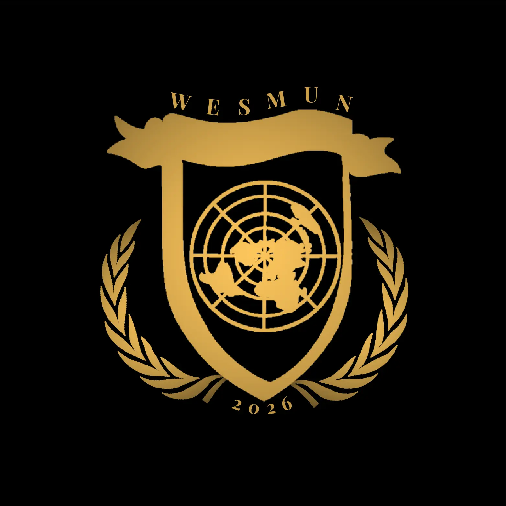

<!--suppress ALL -->
<p align="center">
    
</p>
<p align="center"><h1 align="center">WESMUN</h1>
<p align="center">
    <em>❯ WESMUN's official source code</em>
</p>
<p align="center">
    
    
    
</p>
<p align="center"><!-- default option, no dependency badges. -->
</p>
<br>

## Table of Contents

- [ Overview](#overview)
- [ Features](#features)
- [ Contributing](#contributing)
- [ License](#license)

---

## Overview

WESMUN is a web-based project for managing and displaying
information about various committees and teams involved in the WESMUN event.
The project is built using HTML, CSS, and JavaScript,
and it includes several web pages to showcase different aspects of the event,
such as committees, team members, schedules, and more.

---

## Features

### Core Functionality
- **Committee Management**: Dynamic committee pages with detailed information, background guides, chair profiles, and difficulty levels
- **Department Showcase**: Comprehensive department pages featuring team members, roles, and contact information
- **Event Countdown**: Real-time countdown timer to WESMUN event start date
- **Registration System**: Integrated sign-up forms with payment modal for delegate registration
- **FAQ System**: Categorized frequently asked questions (General, Registration, Committees, Logistics)
- **Contact Page**: Easy-to-access contact information with social media links

### Technical Features
- **Next.js 15**: Built with the latest Next.js framework for optimal performance and SEO
- **TypeScript**: Fully typed codebase for better development experience and fewer bugs
- **Server-Side Rendering**: Fast page loads and improved SEO with SSR capabilities
- **Responsive Design**: Mobile-first design that adapts seamlessly across all devices
- **Modern UI Components**: Utilizes shadcn/ui and Radix UI for accessible, customizable components
- **Dark Mode Support**: Theme switching capability with next-themes
- **Smooth Animations**: Engaging user experience with Framer Motion-style animations
- **Form Validation**: React Hook Form with Zod resolvers for robust form handling
- **Analytics Integration**: Vercel Analytics for tracking user engagement
- **Optimized Images**: Next.js Image component for automatic image optimization

### Design & UX
- **Custom Typography**: Playfair Display font for elegant headings
- **Gradient Backgrounds**: Modern gradient effects and visual polish
- **Interactive Cards**: Hover effects and smooth transitions throughout
- **Scroll-to-Top**: Convenient navigation for long pages
- **Accessible Components**: WCAG-compliant UI elements using Radix UI primitives
- **Loading States**: Proper loading indicators for better UX
- **Toast Notifications**: User feedback system for actions and updates

---

## Contributing

- **💬 [Join the Discussions](https://github.com/DefinetlyNotAI/WesMun/discussions)**: Share your insights, provide
  feedback, or ask questions.
- **🐛 [Report Issues](https://github.com/DefinetlyNotAI/WesMun/issues)**: Submit bugs found or log feature requests for
  the `WesMun` project.
- **💡 [Submit Pull Requests](https://github.com/DefinetlyNotAI/WesMun/blob/main/CONTRIBUTING.md)**: Review open PRs, and
  submit your own PRs.

> [!IMPORTANT]
> To be able to contribute to this project,
> You need a solid ground in react and nextjs,
> you must know its basics and be able to understand the code written,
> and what to replace and what not to replace,
>
> We advise also knowing the basics of GIT as it is the version control
> system used for the project.

<details closed>
<summary>Contributing Guidelines</summary>

1. **Fork the Repository**: Start by forking the project repository to your GitHub account.
2. **Clone Locally**: Clone the forked repository to your local machine using a git client.
   ```sh
   git clone https://github.com/DefinetlyNotAI/WesMun
   ```
3. **Create a New Branch**: Always work on a new branch, giving it a descriptive name.
   ```sh
   git checkout -b new-feature-x
   ```
4. **Make Your Changes**: Develop and test your changes locally.
5. **Commit Your Changes**: Commit with a clear message describing your updates.
   ```sh
   git commit -m 'Implemented new feature x.'
   ```
6. **Push to GitHub**: Push the changes to your forked repository.
   ```sh
   git push origin new-feature-x
   ```
7. **Submit a Pull Request**: Create a PR against the original project repository. Clearly describe the changes and
   their motivations.
8. **Review**: Once your PR is reviewed and approved, it will be merged into the main branch. Congratulations on your
   contribution!

</details>

<details closed>
<summary>Contributor's</summary>
<br>
<p align="left">
   <a href="https://github.com{/DefinetlyNotAI/WesMun/}graphs/contributors">
      
   </a>
</p>
</details>

---

## License

This project doesn't use a ordinary license, it uses a contract-like license,

This has specific dos and don'ts, between 2 parties,
Wesgreen and its brand WESMUN as well as the owner,

For normal users, you follow this [LICENSE](LICENSE), which is "All Rights Reserved".

For Wesgreen, WESMUN, you follow this [LICENSE](LICENSE.md),
which is a contract-like license. (This has been agreed upon by the owner, and Moiz the SG of WESMUN 2025)

---
