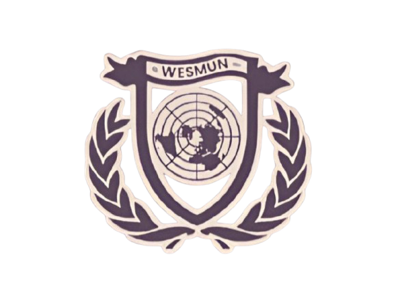

<!--suppress ALL -->
<p align="center">
    
</p>
<p align="center"><h1 align="center">WESMUN</h1>
<p align="center">
    <em>❯ WESMUN's official source code</em>
</p>
<p align="center">
    
    
    
</p>
<p align="center"><!-- default option, no dependency badges. -->
</p>
<br>

## Table of Contents

- [ Overview](#overview)
    - [ Key Features](#key-features)
    - [ Project Structure](#project-structure)
- [ Features](#features)
- [ Project Structure](#project-structure)
    - [ Project Index](#project-index)
- [ Contributing](#contributing)
- [ License](#license)

---

## Overview

WESMUN is a web-based project for managing and displaying
information about various committees and teams involved in the WESMUN event.
The project is built using HTML, CSS, and JavaScript,
and it includes several web pages to showcase different aspects of the event,
such as committees, team members, schedules, and more.

### Key Features

- **Committee Information**: Detailed pages for each committee, including descriptions and member lists.
- **Team Information**: Pages displaying team members with their roles and images.
- **Responsive Design**: The website is designed to be responsive and accessible on various devices.
- **Custom JavaScript**: Includes custom scripts for enhanced functionality and user experience.
- **Bootstrap Integration**: Utilizes Bootstrap for styling and layout.

### Project Structure

- **HTML Files**: Main pages like `index.html`, `team.html`, `committees.html`, etc.
- **CSS Files**: Stylesheets for different parts of the website located in `src/css`.
- **JavaScript Files**: Custom scripts located in `src/js`.
- **Media Files**: Images and other media assets located in `src/media`.

---

## Features

- **Committee Information**: Detailed pages for each committee, including descriptions and member lists.
- **Team Information**: Pages displaying team members with their roles and images.
- **Responsive Design**: The website is designed to be responsive and accessible on various devices.
- **Custom JavaScript**: Includes custom scripts for enhanced functionality and user experience.
- **Bootstrap Integration**: Utilizes Bootstrap for styling and layout.
- **Easy Navigation**: Intuitive navigation structure for easy access to different sections.
- **Modern Design**: Clean and modern design to enhance user experience.
- **Cross-Browser Compatibility**: Ensures the website works well on different browsers.

---

## Project Structure

> [!TIP]
> Only files related to development are shown here.

```md
└── WesMun/
├── 404.html
├── committees
│ ├── Arab_League_Arabic.html
│ ├── Arab_League_English.html
│ ├── ECOSOC.html
│ ├── GA1.html
│ ├── GA4.html
│ ├── HCC.html
│ ├── HSC.html
│ ├── NATO.html
│ ├── UNHCR.html
│ ├── UNHRC.html
│ ├── UNICEF.html
│ ├── UNODC.html
│ ├── UNSC.html
│ ├── UNSC_jr.html
│ ├── UNW.html
│ └── WHO.html
├── committees.html
├── index.html
├── schedule.html
├── src
│ ├── css * Contains all CSS files *
│ ├── download * Contains downloadable files including the PDF's for Background guides *
│ ├── fonts * Contains font files *
│ ├── js * Contains all JavaScript files *
│ └── media * Contains all media files including icons, svg and webp images *
├── team.html
└── venue_and_payments.html
```

### Project Index

<details open>
    <summary><b>WESMUN/</b></summary>
    <details> <!-- / Submodule -->
        <summary><b>/</b></summary>
        <blockquote>
            <table>
            <tr>
                <td><b><a href='https://github.com/DefinetlyNotAI/WesMun/blob/master/committees.html'>committees.html</a></b></td>
                <td>❯ Contains the main page for listing all committees involved in WESMUN.</td>
            </tr>
            <tr>
                <td><b><a href='https://github.com/DefinetlyNotAI/WesMun/blob/master/team.html'>team.html</a></b></td>
                <td>❯ Displays information about the team members and their roles.</td>
            </tr>
            <tr>
                <td><b><a href='https://github.com/DefinetlyNotAI/WesMun/blob/master/venue_and_payments.html'>venue_and_payments.html</a></b></td>
                <td>❯ Provides details about the event venue and payment options.</td>
            </tr>
            <tr>
                <td><b><a href='https://github.com/DefinetlyNotAI/WesMun/blob/master/index.html'>index.html</a></b></td>
                <td>❯ The main landing page of the WESMUN website.</td>
            </tr>
            <tr>
                <td><b><a href='https://github.com/DefinetlyNotAI/WesMun/blob/master/schedule.html'>schedule.html</a></b></td>
                <td>❯ Displays the event schedule and important dates.</td>
            </tr>
            </table>
        </blockquote>
    </details>
    <details> <!-- src Submodule -->
        <summary><b>src</b></summary>
        <blockquote>
            <details>
                <summary><b>css</b></summary>
                <blockquote>
                    <table>
                    <tr>
                        <td><b><a href='https://github.com/DefinetlyNotAI/WesMun/blob/master/src/css/style.css'>style.css</a></b></td>
                        <td>❯ Main stylesheet for the website.</td>
                    </tr>
                    <tr>
                        <td><b><a href='https://github.com/DefinetlyNotAI/WesMun/blob/master/src/css/style.css.map'>style.css.map</a></b></td>
                        <td>❯ Source map for the main stylesheet.</td>
                    </tr>
                    <tr>
                        <td><b><a href='https://github.com/DefinetlyNotAI/WesMun/blob/master/src/css/index.css'>index.css</a></b></td>
                        <td>❯ Styles specific to the index page.</td>
                    </tr>
                    <tr>
                        <td><b><a href='https://github.com/DefinetlyNotAI/WesMun/blob/master/src/css/rules.css'>rules.css</a></b></td>
                        <td>❯ Styles for the rules page.</td>
                    </tr>
                    <tr>
                        <td><b><a href='https://github.com/DefinetlyNotAI/WesMun/blob/master/src/css/responsive.css'>responsive.css</a></b></td>
                        <td>❯ Styles for responsive design.</td>
                    </tr>
                    <tr>
                        <td><b><a href='https://github.com/DefinetlyNotAI/WesMun/blob/master/src/css/font-awesome.min.css'>font-awesome.min.css</a></b></td>
                        <td>❯ Font Awesome icons stylesheet.</td>
                    </tr>
                    <tr>
                        <td><b><a href='https://github.com/DefinetlyNotAI/WesMun/blob/master/src/css/style.scss'>style.scss</a></b></td>
                        <td>❯ SCSS source file for the main stylesheet.</td>
                    </tr>
                    <tr>
                        <td><b><a href='https://github.com/DefinetlyNotAI/WesMun/blob/master/src/css/committees_and_team.css'>committees_and_team.css</a></b></td>
                        <td>❯ Styles for committees and team pages.</td>
                    </tr>
                    </table>
                </blockquote>
            </details>
            <details>
                <summary><b>fonts</b></summary>
                <blockquote>
                    <table>
                    <tr>
                        <td><b><a href='https://github.com/DefinetlyNotAI/WesMun/blob/master/src/fonts/fontawesome-webfont.ttf'>fontawesome-webfont.ttf</a></b></td>
                        <td>❯ Font file for Font Awesome icons.</td>
                    </tr>
                    </table>
                </blockquote>
            </details>
            <details>
                <summary><b>js</b></summary>
                <blockquote>
                    <table>
                    <tr>
                        <td><b><a href='https://github.com/DefinetlyNotAI/WesMun/blob/master/src/js/license.js'>license.js</a></b></td>
                        <td>❯ JavaScript for handling license-related functionality.</td>
                    </tr>
                    <tr>
                        <td><b><a href='https://github.com/DefinetlyNotAI/WesMun/blob/master/src/js/committees.js'>committees.js</a></b></td>
                        <td>❯ JavaScript for committees page functionality.</td>
                    </tr>
                    <tr>
                        <td><b><a href='https://github.com/DefinetlyNotAI/WesMun/blob/master/src/js/index.loading.js'>index.loading.js</a></b></td>
                        <td>❯ JavaScript for loading animations on the index page.</td>
                    </tr>
                    <tr>
                        <td><b><a href='https://github.com/DefinetlyNotAI/WesMun/blob/master/src/js/volunteer.js'>volunteer.js</a></b></td>
                        <td>❯ JavaScript for volunteer-related functionality.</td>
                    </tr>
                    <tr>
                        <td><b><a href='https://github.com/DefinetlyNotAI/WesMun/blob/master/src/js/prettyurl.js'>prettyurl.js</a></b></td>
                        <td>❯ JavaScript for handling pretty URLs.</td>
                    </tr>
                    <tr>
                        <td><b><a href='https://github.com/DefinetlyNotAI/WesMun/blob/master/src/js/index.timer.js'>index.timer.js</a></b></td>
                        <td>❯ JavaScript for timer functionality on the index page.</td>
                    </tr>
                    </table>
                </blockquote>
            </details>
        </blockquote>
    </details>
    <details> <!-- committees Submodule -->
        <summary><b>committees</b></summary>
        <blockquote>
            <table>
            <tr>
                <td><b><a href='https://github.com/DefinetlyNotAI/WesMun/blob/master/committees/UNHCR.html'>UNHCR.html</a></b></td>
                <td>❯ Page for the UNHCR committee.</td>
            </tr>
            <tr>
                <td><b><a href='https://github.com/DefinetlyNotAI/WesMun/blob/master/committees/GA1.html'>GA1.html</a></b></td>
                <td>❯ Page for the GA1 committee.</td>
            </tr>
            <tr>
                <td><b><a href='https://github.com/DefinetlyNotAI/WesMun/blob/master/committees/Arab_League_English.html'>Arab_League_English.html</a></b></td>
                <td>❯ Page for the Arab League (English) committee.</td>
            </tr>
            <tr>
                <td><b><a href='https://github.com/DefinetlyNotAI/WesMun/blob/master/committees/NATO.html'>NATO.html</a></b></td>
                <td>❯ Page for the NATO committee.</td>
            </tr>
            <tr>
                <td><b><a href='https://github.com/DefinetlyNotAI/WesMun/blob/master/committees/GA4.html'>GA4.html</a></b></td>
                <td>❯ Page for the GA4 committee.</td>
            </tr>
            <tr>
                <td><b><a href='https://github.com/DefinetlyNotAI/WesMun/blob/master/committees/UNSC.html'>UNSC.html</a></b></td>
                <td>❯ Page for the UNSC committee.</td>
            </tr>
            <tr>
                <td><b><a href='https://github.com/DefinetlyNotAI/WesMun/blob/master/committees/HCC.html'>HCC.html</a></b></td>
                <td>❯ Page for the HCC committee.</td>
            </tr>
            <tr>
                <td><b><a href='https://github.com/DefinetlyNotAI/WesMun/blob/master/committees/UNSC_jr.html'>UNSC_jr.html</a></b></td>
                <td>❯ Page for the UNSC Junior committee.</td>
            </tr>
            <tr>
                <td><b><a href='https://github.com/DefinetlyNotAI/WesMun/blob/master/committees/UNICEF.html'>UNICEF.html</a></b></td>
                <td>❯ Page for the UNICEF committee.</td>
            </tr>
            <tr>
                <td><b><a href='https://github.com/DefinetlyNotAI/WesMun/blob/master/committees/Arab_League_Arabic.html'>Arab_League_Arabic.html</a></b></td>
                <td>❯ Page for the Arab League (Arabic) committee.</td>
            </tr>
            <tr>
                <td><b><a href='https://github.com/DefinetlyNotAI/WesMun/blob/master/committees/UNODC.html'>UNODC.html</a></b></td>
                <td>❯ Page for the UNODC committee.</td>
            </tr>
            <tr>
                <td><b><a href='https://github.com/DefinetlyNotAI/WesMun/blob/master/committees/ECOSOC.html'>ECOSOC.html</a></b></td>
                <td>❯ Page for the ECOSOC committee.</td>
            </tr>
            <tr>
                <td><b><a href='https://github.com/DefinetlyNotAI/WesMun/blob/master/committees/HSC.html'>HSC.html</a></b></td>
                <td>❯ Page for the HSC committee.</td>
            </tr>
            <tr>
                <td><b><a href='https://github.com/DefinetlyNotAI/WesMun/blob/master/committees/WHO.html'>WHO.html</a></b></td>
                <td>❯ Page for the WHO committee.</td>
            </tr>
            <tr>
                <td><b><a href='https://github.com/DefinetlyNotAI/WesMun/blob/master/committees/UNHRC.html'>UNHRC.html</a></b></td>
                <td>❯ Page for the UNHRC committee.</td>
            </tr>
            <tr>
                <td><b><a href='https://github.com/DefinetlyNotAI/WesMun/blob/master/committees/UNW.html'>UNW.html</a></b></td>
                <td>❯ Page for the UNW committee.</td>
            </tr>
            </table>
        </blockquote>
    </details>
</details>

---

## Contributing

- **💬 [Join the Discussions](https://github.com/DefinetlyNotAI/WesMun/discussions)**: Share your insights, provide
  feedback, or ask questions.
- **🐛 [Report Issues](https://github.com/DefinetlyNotAI/WesMun/issues)**: Submit bugs found or log feature requests for
  the `WesMun` project.
- **💡 [Submit Pull Requests](https://github.com/DefinetlyNotAI/WesMun/blob/main/CONTRIBUTING.md)**: Review open PRs, and
  submit your own PRs.

> [!IMPORTANT]
> To be able to contribute to this project,
> You need a solid ground in html,
> you must know its basics and be able to understand the code written,
> and what to replace and what not to replace,
>
> We advise also knowing the basics of GIT as it is the version control
> system used for the project.

<details closed>
<summary>Contributing Guidelines</summary>

1. **Fork the Repository**: Start by forking the project repository to your GitHub account.
2. **Clone Locally**: Clone the forked repository to your local machine using a git client.
   ```sh
   git clone https://github.com/DefinetlyNotAI/WesMun
   ```
3. **Create a New Branch**: Always work on a new branch, giving it a descriptive name.
   ```sh
   git checkout -b new-feature-x
   ```
4. **Make Your Changes**: Develop and test your changes locally.
5. **Commit Your Changes**: Commit with a clear message describing your updates.
   ```sh
   git commit -m 'Implemented new feature x.'
   ```
6. **Push to GitHub**: Push the changes to your forked repository.
   ```sh
   git push origin new-feature-x
   ```
7. **Submit a Pull Request**: Create a PR against the original project repository. Clearly describe the changes and
   their motivations.
8. **Review**: Once your PR is reviewed and approved, it will be merged into the main branch. Congratulations on your
   contribution!

</details>

<details closed>
<summary>Contributor's</summary>
<br>
<p align="left">
   <a href="https://github.com{/DefinetlyNotAI/WesMun/}graphs/contributors">
      
   </a>
</p>
</details>

---

## License

This project doesn't use a ordinary license, it uses a contract-like license,

This has specific dos and don'ts, between 2 parties,
Wesgreen and its brand WESMUN as well as the owner,

For normal users, you follow this [LICENSE](LICENSE), which is "All Rights Reserved".

For Wesgreen, WESMUN, you follow this [LICENSE](LICENSE.md),
which is a contract-like license. (This has been agreed upon by the owner,
and Moiz the SG of WESMUN 25)

---